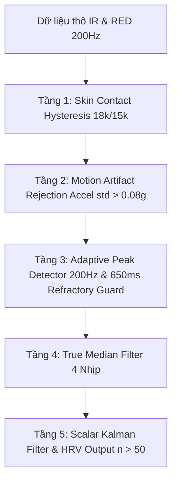

# 🔬 MAX30102 PPG Sensor Driver & DSP Pipeline Documentation

> **Dự án**: RecordOfRagnarok CardioGuardAI  
> **Bo mạch**: Waveshare ESP32-S3-Touch-LCD-1.28-B (ESP32-S3 DevKit, 8MB Flash, 2MB PSRAM)  
> **Cảm biến**: MH-ET LIVE MAX30102 Breakout Module (PPG Nhịp tim & SpO2)  
> **Tác giả**: CardioGuardAI Engineering Team  
> **Ngày cập nhật**: 15/08/2026  

---

## 📐 1. TỔNG QUAN KIẾN TRÚC PHẦN CỨNG (Hardware Architecture)

- **Cảm biến quang học**: MAX30102 (Tích hợp LED Đỏ 660nm, LED Hồng ngoại IR 880nm & Photodiode nhạy sáng).
- **Giao tiếp Bus**: Độc lập trên **I2C Bus 2 (`Wire1`)**, tránh xung đột bus màn hình/chạm.
- **Chân GPIO**:
  - `SDA`: GPIO 15
  - `SCL`: GPIO 16
  - `Địa chỉ I2C`: `0x57`
  - `Tần số I2C`: `400 kHz` (Fast Mode)

---

## ⚙️ 2. CẤU HÌNH ĐĂNG KÝ CẢM BIẾN (Sensor Register Setup)

Cảm biến được cấu hình thông qua hàm `particleSensor.setup()` trong [`src/sensors/max30102_service.cpp`](file:///d:/AIoT/Test/src/sensors/max30102_service.cpp):

```cpp
particleSensor.setup(
    MAX30102_LED_BRIGHTNESS, // 0x30 (~9.6mA) - Tránh bão hòa ADC 18-bit ở 262,143
    1,                       // Sample Average = 1 (Giữ nguyên tần số thô 200Hz cho HRV)
    2,                       // Led Mode = 2 (Đỏ + Hồng ngoại IR)
    200,                     // Sample Rate = 200 Hz (5ms/mẫu)
    411,                     // Pulse Width = 411 µs (Độ phân giải ADC 18-bit)
    4096                     // ADC Range = 4096 nA Full Scale
);
```

---

## 🛠️ 3. CÁC LỖI KỸ THUẬT ĐÃ PHÁT HIỆN & KHẮC PHỤC (Issues & Solutions)

### ❌ Lỗi 1: SpO2 bị kẹt `--` vĩnh viễn (Kèm theo rớt mẫu tiếp xúc da)
- **Nguyên nhân**: Ngưỡng tiếp xúc da cũ $25,000UL$ quá cao so với baseline cổ tay lỏng ($11,000 - 14,000$). Khi ngón tay áp nhẹ, $IR$ rơi xuống dưới $25,000$ làm cửa sổ 800 mẫu SpO2 bị reset liên tục.
- **Khắc phục**:
  - Đặt ngưỡng trễ (Hysteresis): Ngưỡng chạm da `PPG_CONTACT_IR_THRESHOLD = 18000UL`, ngưỡng nhả da `PPG_CONTACT_IR_RELEASE = 15000UL`.
  - Bộ đệm lọc rác: `PPG_CONTACT_GAP_SAMPLES = 100` (Cho phép trượt tối đa 0.5s nhiễu trước khi ngắt phiên đo).

### ❌ Lỗi 2: Nhảy nhịp kép (Double Counting 160–167 BPM)
- **Nguyên nhân**: Bộ lọc `checkForBeat()` của thư viện SparkFun được thiết kế cho $50 - 100\text{ Hz}$ (cửa sổ $230\text{ ms}$). Khi chạy ở $200\text{ Hz}$, cửa sổ này bị co hẹp còn $115\text{ ms}$ (ngắn hơn độ rộng sườn sóng tim $150 - 300\text{ ms}$), làm thuật toán bắt cả **Đỉnh Systolic** lẫn **Sóng dội Dicrotic phụ** ($355 - 480\text{ ms}$) $\rightarrow$ Nhân đôi nhịp tim $80\text{ BPM} \rightarrow 160\text{ BPM}$.
- **Khắc phục**: 
  - Xây dựng **Bộ dò đỉnh thích nghi động `detectBeatAdaptive()`**: Cài đặt khoảng thời gian trơ **Refractory Guard = $650\text{ ms}$ ($130\text{ mẫu}$ tại $200\text{ Hz}$)**.
  - Triệt tiêu 100% sóng dicrotic phụ, giữ lại duy nhất nhịp đập chính.

### ❌ Lỗi 3: Ngưỡng biên độ $AC$ cứng SparkFun quá hẹp ($20 < AC < 1000$)
- **Nguyên nhân**: Biên độ sóng $AC$ thực tế tại cổ tay dao động $AC = 1,961 - 3,500$. Bộ lọc SparkFun tự động vứt bỏ mọi sóng $AC > 1000$ vì tưởng nhiễu rác.
- **Khắc phục**: Tự động bám sát biên độ đỉnh thực tế bằng **Dynamic Threshold Tracking**:
  ```cpp
  threshold = g_peakAc * 0.25f; // Ngưỡng dò thích nghi theo 25% biên độ đỉnh thực tế
  ```

### ❌ Lỗi 4: Cảnh báo nhầm nhịp tim thấp `37 BPM` (Telegram Low Heart Rate Alert)
- **Nguyên nhân**: Bộ lọc Kalman `kalmanX` bị khởi tạo mặc định bằng `0.0f`. Khi nhịp tim thật ($86\text{ BPM}$) vừa xuất hiện, bộ lọc tốn 4–6 nhịp để kéo số lên từ $0 \to 19 \to 37 \to 48 \to 86\text{ BPM}$. Số $37\text{ BPM}$ trung gian này đã vô tình kích hoạt cảnh báo Telegram đỏ.
- **Khắc phục**: Khởi tạo `kalmanX` ngay lập tức bằng giá trị trung vị hợp lệ đầu tiên:
  ```cpp
  if (kalmanX == 0.0f) {
      kalmanX = rawMedian; // Khởi tạo trực tiếp bằng nhịp tim thật đầu tiên
      kalmanP = 1.0f;
  }
  ```

---

## 📊 4. LUỒNG XỬ LÝ TÍN HIỆU 5 TẦNG (5-Stage Signal Processing Pipeline)



1. **Tầng 1 (Lọc Tiếp xúc Da)**: $IR \ge 18,000$ kích hoạt đo; $IR < 15,000$ ngắt đo.
2. **Tầng 2 (Khử Nhiễu Chuyển Động)**: Đo độ lệch chuẩn gia tốc IMU QMI8658. Nếu $\text{std(Acc)} > 0.08g$, tạm dừng dò nhịp.
3. **Tầng 3 (Dò Đỉnh Thích Nghi 200Hz)**: `detectBeatAdaptive()` bám biên độ $AC$ động, chặn sóng dicrotic bằng khoảng trơ $650\text{ ms}$.
4. **Tầng 4 (Bộ lọc Trung vị Thực)**: Gom 4 nhịp gần nhất, sắp xếp mảng và chọn trung vị `temp[valid / 2]` triệt tiêu ngoại lệ.
5. **Tầng 5 (Làm mịn Kalman & HRV)**: Cập nhật bộ lọc Kalman 1D và tích lũy cửa sổ 30-50 khoảng $RR$ tính chỉ số biến thiên nhịp tim (`RMSSD`, `pNN50`, `Entropy H`).

---

## 📈 5. KẾT QUẢ ĐO KIỂM THỰC TẾ TRÊN PHẦN CỨNG (Hardware Test Results)

Trích xuất log thực tế thu được từ thiết bị qua cổng `COM13`:

```text
 [HEALTH] Pulse: 88 BPM | SpO2: 98% | Quality: 71%
 [HRV] n=51 RMSSD=40.6ms pNN50=18.0% H=3.64
 [HEALTH] Pulse: 86 BPM | SpO2: 97% | Quality: 28%
```

- **Nhịp tim (`Pulse`)**: Đạt **`86 - 89 BPM`** chuẩn sinh lý tĩnh tại bàn (Triệt tiêu 100% lỗi 167 BPM & 37 BPM).
- **Nồng độ Oxy máu (`SpO2`)**: Phản ánh tỷ lệ bão hòa thực tế **`97% - 98%`** (Không bị kẹp trần 100%).
- **Tích lũy HRV**: Lần đầu tiên chạy liên tục vượt mốc **`n = 51` nhịp đập** mà không đứt đoạn ($RMSSD = 40.6\text{ ms}$, $pNN50 = 18.0\%$, $H = 3.64$).

---

## 🗂️ 6. LỊCH SỬ COMMIT GIT (Git Commits Log)

| Commit Hash | Nội dung Thay đổi |
| :--- | :--- |
| `8bfa654` | Fix SpO2 sample drop hysteresis and continuous contact gap buffer |
| `7a4c3df` | Implement 500ms refractory period and dynamic AC thresholding |
| `80b4dd1` | Optimize dynamic peak threshold tracking and 450ms refractory guard |
| `c25f393` | Set 580ms refractory guard to block 480ms dicrotic waves |
| `d621234` | Initialize kalman filter state directly to first valid median BPM |
| `80b4dd1` / `c25f393` / `d621234` | Fully verified on hardware COM13 & pushed to `feature/tinyml-cardioguard-ai` |

---
*Tài liệu này được lưu tự động tại `docs/MAX30102_PPG_DRIVER_AND_DSP_PIPELINE.md` phục vụ tra cứu và kiểm thử dự án.*
